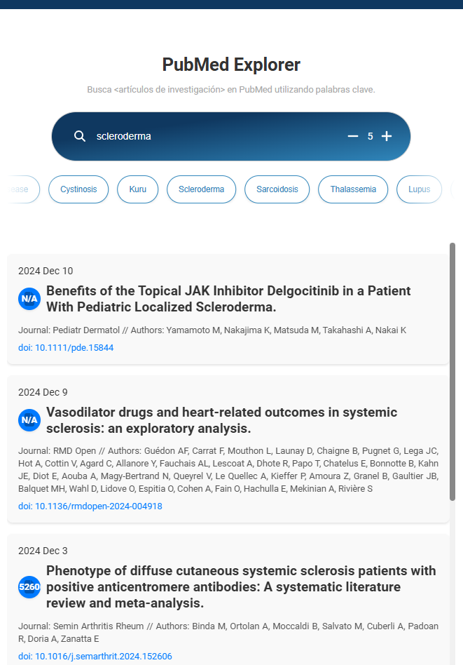

# PubMedExplorer

PubMedExplorer is a Python-based application that provides a user-friendly interface to search and explore research articles from PubMed.

## Table of Contents

- [Installation](#installation)
- [Usage](#usage)
  - [Starting the Development Environment](#starting-the-development-environment)
  - [Running the Server](#running-the-server)
  - [Accessing the Frontend](#accessing-the-frontend)
- [Project Structure](#project-structure)
- [Testing](#testing)
  - [Executing Tests](#executing-tests)
    - [Ensure the Server is Running](#ensure-the-server-is-running)
    - [Run the Performance Tests](#run-the-performance-tests)
    - [Run the API Tests](#run-the-api-tests)
- [Design Details](#design-details)

## Installation

### Clone the Repository

```bash
git clone <repository_url>
```

### Install Poetry

If you haven't installed Poetry yet, follow the [official installation guide](https://python-poetry.org/docs/#installation).

### Install Dependencies

Use Poetry to install project dependencies and create a virtual environment:

```bash
poetry install
```

## Usage

### Starting the Development Environment

Activate the Poetry shell to work within the project's virtual environment:

```bash
poetry shell
```

### Running the Server

Start the Flask backend server using the `server.py` script:

```bash
python app/server.py
```

### Accessing the Frontend

Once the server is running, open your web browser and navigate to `http://localhost:5000` to access the frontend interface. The frontend communicates with the Flask backend via REST API to fetch and display data from PubMed.



## Project Structure

```
app/                     # Contains the Flask application code
  __init__.py            # Initializes the Flask app
  pubmed.py              # Handles interactions with the PubMed API
  routes.py              # Defines the application routes/endpoints
  server.py              # Entry point to run the Flask server
config/                  # Configuration files
  pubmed_config.py       # Configuration settings for PubMed API interactions
frontend/                # Frontend assets
  templates/
    index.html           # Main HTML template
  static/css/
    styles.css           # Stylesheet for the frontend
  static/js/
    scripts.js           # JavaScript for frontend functionality
    search-suggestions.json # JSON file containing search suggestions
    LoadingAnimation.jsx # (Unused) React component for loading animations
  static/svgs/           # SVG icons used in the frontend
tests/                   # Testing scripts
  performance/
    performance_test.py  # Performance tests comparing implementations
    implementations/
      pubmed_v0.py       # Original implementation for comparison
  test_api.py            # Quick API tests to validate backend endpoints
pyproject.toml           # Poetry configuration file managing dependencies
README.md                # Project documentation
```

## Testing

The `tests` folder includes scripts for performance testing and quick API validations. These tests are optional and primarily used for ensuring the application performs efficiently and the API endpoints function correctly.

### Executing Tests

#### Ensure the Server is Running

Start the server in a terminal:

```bash
python app/server.py
```

#### Run the Performance Tests

Open another terminal within the Poetry shell and execute the performance test script:

```bash
python tests/performance/performance_test.py
```

This script compares the performance of the original and optimized functions for fetching PubMed articles.

#### Run the API Tests

In the Poetry shell, execute the API test script:

```bash
python tests/test_api.py
```

This script performs a quick validation of the `/search` endpoint to ensure it returns the expected results.

*Note*: The tests rely on the backend server being active to function correctly.

## Design Details

- **Virtual Environment Management**: Poetry ensures that all dependencies are isolated within the project's virtual environment, preventing conflicts with other Python projects.
- **API Configuration**: The `config/pubmed_config.py` file manages the configuration for interacting with the PubMed API, including base URLs, default parameters, search parameters, and rate limiting settings.
- **Rate Limiting and Caching**: The `app/pubmed.py` module implements rate limiting to control the frequency of API requests and uses caching to store recent search results, enhancing performance.
- **Frontend Interaction**: The frontend, built with HTML, CSS, and JavaScript, communicates with the Flask backend via REST API to fetch and display research articles based on user queries.
- **Logging and Debugging**: The Flask server is set to run in debug mode (`debug=True`) for easier troubleshooting during development. Logs can be enhanced further by integrating Python’s logging module as needed.
- **Extensibility**: The project structure is modular, allowing for easy addition of new features, routes, or tests. Unused components, like the `LoadingAnimation.jsx`, are included for potential future enhancements.
